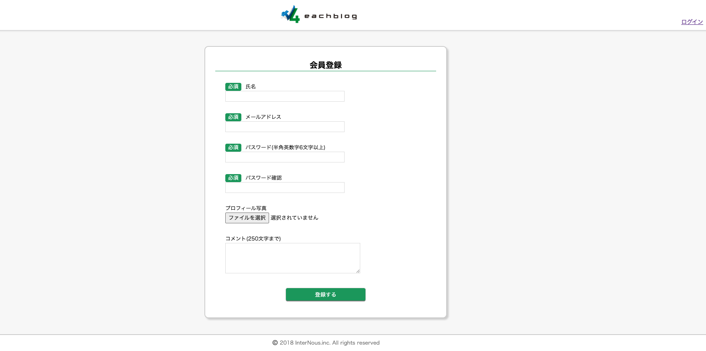
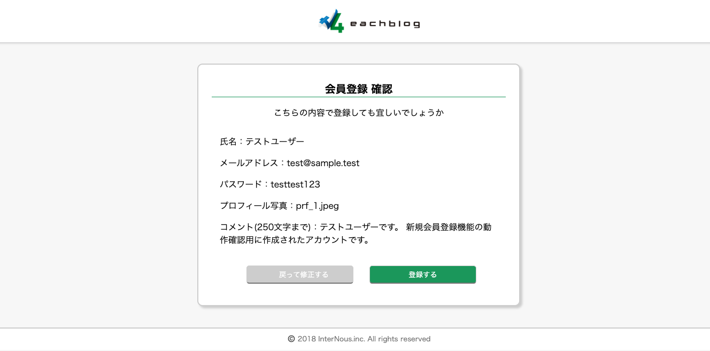
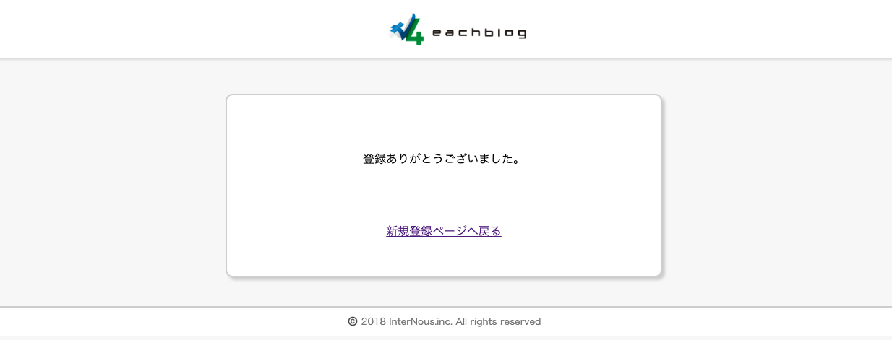
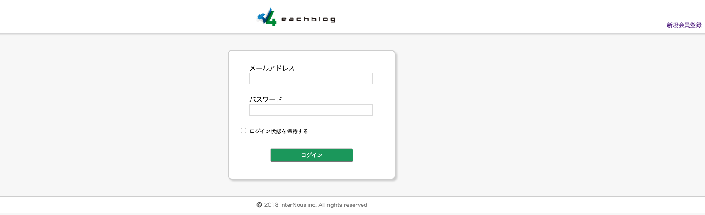
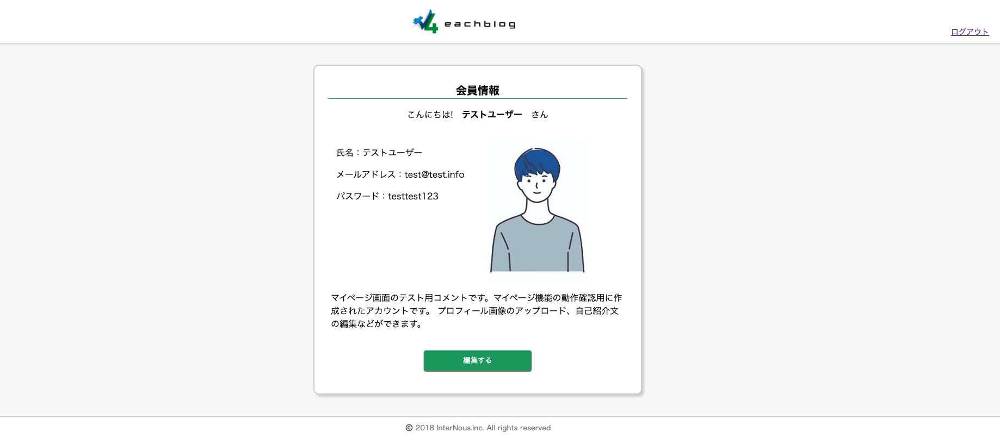
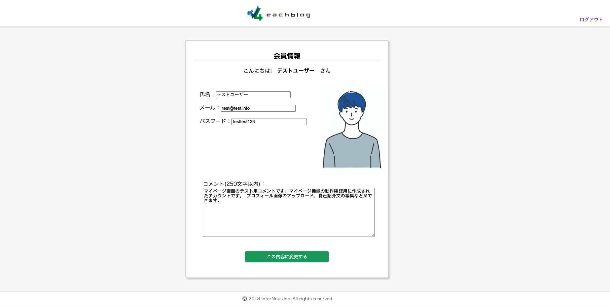
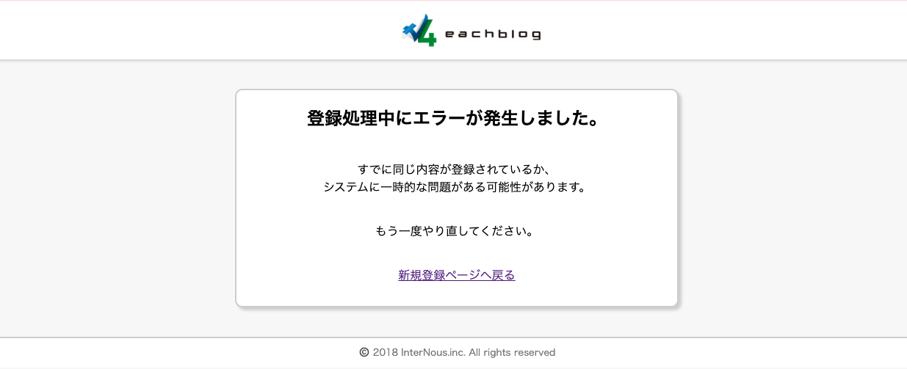

# 会員制マイページ管理システム

## 概要

- 研修課題として制作した、新規会員登録、ログイン機能、プロフィール編集・更新までの一連のユーザー管理機能を備えたWebアプリケーション
- セッション管理やデータベース連携を通した、セキュアな会員限定機能の構築を目的としている

## スクリーンショット

### 会員登録画面

### 会員登録確認画面

### 会員登録完了画面(サンクスページ)

### ログイン画面

### マイページ

### マイページ編集画面

### エラー画面

## 主な機能

- 新規会員登録機能: 入力バリデーションおよびデータベースへのデータ永続化
- ログイン/ログアウト機能: セッションを利用した認証管理
- マイページ表示: ログインユーザーごとの個別情報の表示
- プロフィール編集機能: 登録済み情報の取得およびデータベースの更新処理

## 使用技術 (Tech Stack)

- フロントエンド: HTML, CSS
- バックエンド: PHP
- データベース: MySQL
- 開発環境: MAMP

## ディレクトリ構造

🔐 会員登録・確認

- `register.php / .css`: 新規会員登録画面とデザイン
- `register_confirm.php / .css`: 登録内容の最終確認画面
- `register_insert.php`: データベースへの新規登録処理
- `after_register.html / .css`: 登録完了後のサンクスページ

🗝️ ログイン機能

- `login.php / .css`: ログイン画面とデザイン
- `log_out.php`: セッション破棄によるログアウト処理

👤 マイページ管理

- `mypage.php / .css`: 会員情報の表示画面
- `mypage_hensyu.php / .css`: 登録情報の編集フォーム
- `mypage_update.php `: 編集内容のデータベース更新処理

⚠️ エラー・例外処理

- `after_exception.html / .css `: データベース接続エラー等の例外発生時に表示するページ

⚙️ その他

- `image/` : プロフィール画像を格納するフォルダ
- `docs/` : スクリーンショットを格納するフォルダ
- `4eachblog_logo.jpg` : サイトロゴ画像
- `.gitignore` : Git管理から除外する設定ファイル（.vscode 等）
